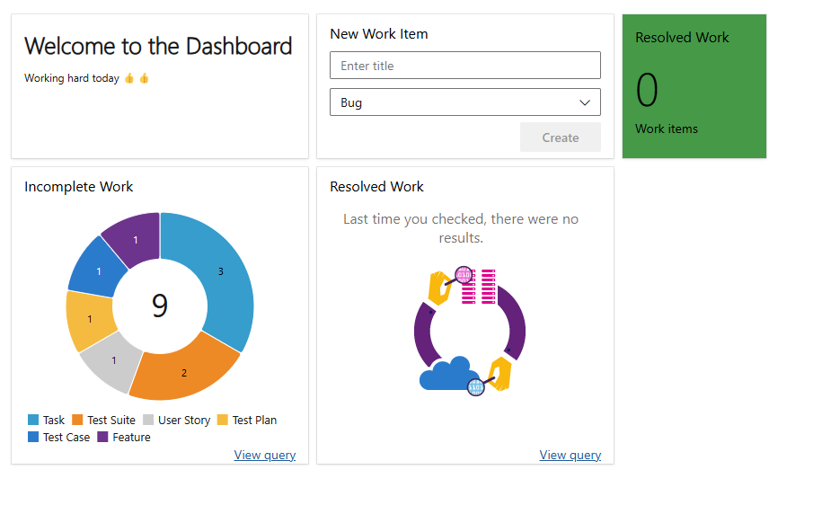

# Azure Devops Introduction

## History

- Originally Team Foundation Server (TFS)
- Rebranded as Azure DevOps in 2018
- Offering tools for version control, CI/CD, testing, and project management.

## Examine Main Features

- **Overview**

  - **Summary**: summary page for project
  - **Dashboards**: Customizable dashboards to visualize project data and workflows in real-time.
  - **Wiki**: brain dump

---

- **Boards**

  - **Work Items**: Track tasks, bugs, or user stories to organize and manage project workflows.

  - **Boards**: Visualize and manage work using a Kanban-style interface.

  - **Backlogs**: Prioritize and manage work items for current and future sprints.

  - **Sprints**: Plan and execute incremental iterations of work within a given time period.

  - **Queries**: Retrieve and filter specific work items based on custom criteria.

  - **Delivery Plans**: Visualize work across multiple teams and projects to align delivery schedules.

  - **Analytics Views**: Create customizable views to gain insights into project progress and performance.

---

- **Repos**

  - **Files**: View, edit, and manage files within the Git repository.

  - **Commits**: Track changes and history of code modifications.

  - **Pushes**: Record updates when changes are sent to the remote repository.

  - **Branches**: Manage parallel versions of the codebase for feature development or bug fixes.

  - **Tags**: Mark specific points in the code history, such as releases or milestones.

  - **Pull Requests**: Collaborate by reviewing and merging changes into the main codebase.

  - **Advanced Security**: Protect code with features like branch policies, permissions, and security scanning tools

---

- **Pipelines**: Automate building, testing, and deploying your code across environments. Supports CI/CD workflows to streamline software delivery.
  - **Pipelines**: Core component for creating and managing automated workflows for building, testing, and deploying code.
  - **Environments**: Define and manage deployment targets, such as virtual machines, Kubernetes clusters, or other resources, for better deployment management.
  - **Releases**: Automate application deployment to multiple environments with detailed configurations, approval workflows, and tracking.
  - **Library**: A centralized store for reusable variables, secrets, and secure files that can be shared across pipelines for consistency.
  - **Task Groups**: Combine multiple pipeline tasks into reusable units, reducing duplication and simplifying pipeline maintenance.
  - **Deployment Groups**: Organize machines for deployment tasks, enabling targeted or sequential deployment to specific servers or groups.
  - **XAML**: Refers to legacy build definitions in Azure DevOps (formerly TFS). These have been replaced with YAML-based pipelines but still exist for backward compatibility.

---

- **Test Plans**: A suite of tools for managing test cases, creating test suites, and tracking test execution to ensure software quality.
  - **Test Plans**: Define and organize test efforts, including manual, exploratory, and automated testing workflows.
  - **Progress Report**: Provides insights into the status of test executions, such as pass/fail rates and overall test coverage.
  - **Runs**: Represents the execution of test cases, allowing you to track results and log any discovered issues.

---

- Artifacts
  - Nuget package generation - pack your classlib to your nuget feed

---

## Workshop

Lets go..

    - In Azure Devops Repo
    - Clone repo
    - Create content for repo e.g. classlib with some tests (copy previous)
    - Create a Board
    - Add some Work Items
    - Create Some Queries
    - Create a Dashboard

    - Create a pipeline

[Return](https://github.com/uerbzr/course-devops-introduction)
